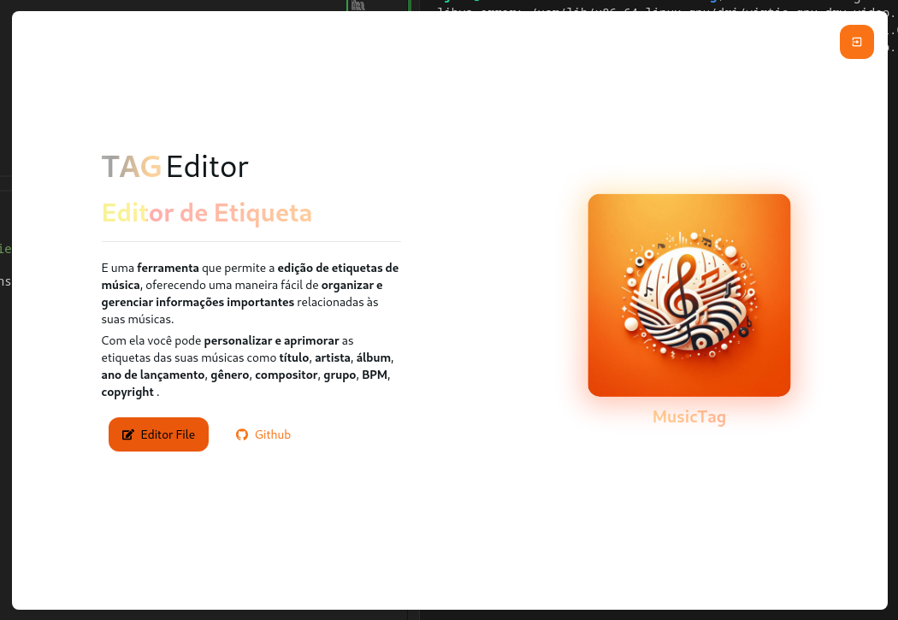

# MusicDetailsWeb

É um ferramenta que permite a edição de etiquetas de música, proporcionando uma maneira fácil e eficiente de organizar e gerenciar informações importantes relacionadas ao seu audio.

Com esta ferramenta, você pode personalizar e aprimorar as informações das suas músicas favoritas, como:

- Título
- Artistas
- Album
- Ano de lançamento
- Gênero
- Compositor
- etc
   
